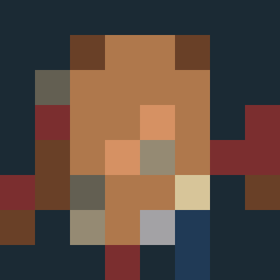
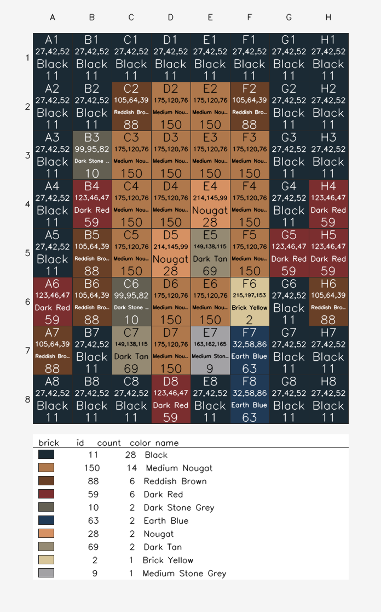

# legome

[](https://github.com/geraldo-netto/legome/actions/workflows/ci.yml)

Quantize any image to a Lego brick color palette. Use the result as a build
plan for a Lego "painting" / mosaic.

By default, every output pixel is the closest **real Lego brick color**
(nearest-neighbor in RGB), so every pixel in the result corresponds to a
piece you can actually order.

| Original | Lego mosaic |
| :---: | :---: |
|  |  |

## Install

From a clone (no install, dev/edit loop):

```bash
git clone https://github.com/geraldo-netto/legome
cd legome
pip3 install numpy opencv-python
python3 -m legome example/input.jpg example/output.png
```

Or as a wheel (gives you the `legome` console script):

```bash
pip install .                # runtime only
pip install -e .[dev]        # editable + pytest, hypothesis, mypy, ruff
legome example/input.jpg example/output.png
```

## Usage

```bash
legome <input-image> <output-image> [options]
# equivalently:
python3 -m legome <input-image> <output-image> [options]

  --palette PATH       custom palette: JSON or GIMP .gpl (default: bundled real-Lego brick palette)
  --resize WxH|preset  resize before quantization; presets: 48x48, a4, a3, a2, a1, mosaic
  --no-display         do not open a preview window after writing output
  -v, --verbose        INFO-level logging
  --version            print version and exit
```

Running `legome` with no arguments prints the full help (including the
sections below) and exits 0 — useful for discoverability.

## Modes

| Mode                  | Palette used                                        | Output is buildable in real bricks?                            |
| --------------------- | --------------------------------------------------- | -------------------------------------------------------------- |
| **default**           | `legome.lego_colors.LEGO_COLORS` (49 solid colors)  | Yes — every pixel is a real Lego brick color.                   |
| `--palette PATH`      | The 256-LUT or `colors` palette loaded from `PATH`. | Only if `PATH` itself contains buildable colors.                |

## Build plans

`--build-plan PATH` writes a printable PNG where each brick cell carries four
stacked labels — **coordinate** (`A1`), **RGB** triple, **color name**, and
**Bricklink ID** — and a legend below the grid lists how many of each brick
you need to order.

| Quantized mosaic | Build plan (zoomed-in view) |
| :---: | :---: |
|  |  |

> **Note.** The build-plan PNG is rendered at print resolution (~100 px per
> brick). At a thumbnail size the cell labels collapse into a dark band — the
> text is meant to be read at native resolution. **Zoom in** (your image
> viewer's `+` key, or your browser's Ctrl/Cmd+scroll) until the
> `coord / RGB / name / id` lines are legible. The preview window opened by
> `legome` also lets you resize and the image keeps its aspect ratio.

The same build also produces a brick-count shopping list. For the 8x8 example
above, the parts you need to order are:

| Brick ID | Count | Color name |
| :---: | ---: | :--- |
| 11 | 28 | Black |
| 150 | 14 | Medium Nougat |
| 59 | 6 | Dark Red |
| 88 | 6 | Reddish Brown |
| 28 | 2 | Nougat |
| 10 | 2 | Dark Stone Grey |
| 69 | 2 | Dark Tan |
| 63 | 2 | Earth Blue |
| 2 | 1 | Brick Yellow |
| 9 | 1 | Medium Stone Grey |

Total: **64 bricks, 10 distinct colors.** Open each `Brick ID` at
`https://www.bricklink.com/catalogItemInv.asp?colorID=<id>` to source the
pieces (the same lookup is exposed programmatically as
`legome.lego_colors.bricklink_url(color)`).

## Exit codes

| code | meaning                                                                |
| ---- | ---------------------------------------------------------------------- |
| 0    | success                                                                |
| 2    | input / output / palette validation error (also `cv2.imread` returned None) |
| 3    | OpenCV (`cv2`) is not installed                                        |
| 4    | `cv2.imwrite` refused to write the requested output path               |

## How it works

```
+---------+   cv2.imread   +---------------+   nearest-neighbor   +---------------+   cv2.imwrite   +---------+
| input   |--------------->| BGR ndarray   |--------------------->| palette       |---------------->| output  |
| .jpg/   |                | (H,W,3) uint8 |  Euclidean distance  | ndarray       |                 | .png    |
| .png ...|                +---------------+                      +---------------+                 +---------+
                                ^                                                                       ^
                                |                                                                       |
                                |   reconcile_input_extension(...)               reconcile_output_extension(...)
                                |   warns when file header disagrees with        rewrites unsupported extensions
                                |   filename extension (REL-13).                 to .png and warns about lossy JPEG (REL-14).
```

The hot loop is in [legome/processor.py](legome/processor.py): the unique
colors of the palette are converted to a `(M,3)` BGR int32 array, and the
image is processed in 65 536-pixel chunks. For each chunk, a `(K, M, 3)`
broadcast subtracts the palette from every pixel, `argmin` over the
squared-distance axis picks the closest palette color, and the result is
gathered back into a uint8 image.

## Performance

`apply_palette` auto-picks the fastest implementation given the image size
(threshold ~2 MP). The chunked broadcast quantizer wins on small images;
above the threshold, a 256³ BGR → palette LUT is built once via
`scipy.spatial.KDTree` and indexed per-pixel (cached across calls in batch
mode). Pass `method="broadcast"` or `method="lut3d"` to override.

Microbenchmarks (see `benchmarks/RESULTS.md` for the full table):

| op                                  | before  | after  | speedup |
| ----------------------------------- | -------:| ------:| -------:|
| `output_pixels_in_palette` (262k px)| 675 ms  | 4 ms   | 162×    |
| `match_palette_to_lego` (112 colors)| 3.3 ms  | 0.6 ms | 5.4×    |
| 4 MP image quantize                 | 18 300 ms | 8 200 ms | 2.2× |

Reproduce with `python3 -m benchmarks.bench_perf`.

## Palette JSON schema

Both the new and the legacy layout are accepted (FMT-02):

```jsonc
{
  "name": "lego",                            // required
  "description": "...",                      // optional
  "source": "...",                           // optional
  "colors": [[r, g, b], ...]                 // preferred: any number of RGB triples (>= 1)
  // OR
  "lut":    [[r, g, b], ... 256 entries]    // legacy: exactly 256 entries (one per grayscale index)
}
```

- `colors` is the canonical layout — `apply_palette` reads only the unique
  set of colors, so any length works.
- `lut` is retained for files generated for `cv2.applyColorMap` / `cv2.LUT`
  workflows; on load it is treated as a 256-color palette.
- Each entry must be a 3-element `[r, g, b]` array with channels in `[0, 255]`.
- A short or malformed entry produces a clear error message that includes the
  offending index (`"palette entry 17 must be an RGB triple, got 2-tuple"`).

## GIMP `.gpl` palettes

`--palette my-palette.gpl` is auto-detected by file extension. Any
GIMP/Krita/Inkscape/Aseprite palette export Just Works. The bundled
`legome/palettes/lego_bricks.gpl` is generated from
`legome.lego_colors.LEGO_COLORS` via `scripts/build_palettes.py` and
imports cleanly into the same tools.

## Project layout

```
legome/
  __init__.py
  __main__.py                  # python -m legome
  cli.py                       # argparse + orchestration
  palette.py                   # JSON loader + Palette dataclass + lego_palette()
  processor.py                 # nearest-neighbor quantizer (broadcast + 3D LUT)
  display.py                   # optional GUI preview, headless-safe
  imageio.py                   # magic-byte format detection + extension reconciliation
  resize.py                    # --resize parser + INTER_AREA wrapper
  gpl.py                       # GIMP .gpl palette loader
  lego_colors.py               # reference DB of solid Lego brick RGBs + Bricklink IDs
  palettes/lego.json           # legacy 112-color colormap palette
  palettes/lego_bricks.json    # generated from LEGO_COLORS (canonical JSON)
  palettes/lego_bricks.gpl     # generated from LEGO_COLORS (cross-tool)
benchmarks/                    # perf regression baseline (bench_perf.py + RESULTS.md)
scripts/build_palettes.py      # regenerate the derived palette files
example/{input.jpg,output.png}
tests/                         # 162 tests, 96% coverage, Hypothesis fuzz
pyproject.toml                 # PEP 621 build, console_scripts, dev extras
.github/workflows/ci.yml       # GH Actions: ruff + mypy + pytest x py3.10/11/12
.pre-commit-config.yaml        # ruff, ruff-format, mypy, yaml/toml lint
```

## Tests, lint, type-check

```bash
pip install -e .[dev]
python3 -m pytest tests/ --cov=legome      # 162 tests, 96% cov
python3 -m mypy legome/                    # clean
ruff check legome/ tests/                  # clean
```

Slow subprocess tests are tagged `@pytest.mark.slow` so a fast loop can run
`pytest -m "not slow"`.

## Lego authenticity

`legome.lego_colors.LEGO_COLORS` ships an RGB DB of 49 solid Lego brick
colors (canonical Bricklink / Rebrickable values), with `aliases` for
catalog naming differences (e.g. `Tan` is an alias for `Brick Yellow`,
`Dark Blue` for `Earth Blue`). Helpers:

- `closest_lego_color(rgb)` returns the closest `LegoColor` plus its
  Euclidean distance.
- `match_palette_to_lego(colors, threshold=40)` returns a per-color match
  report.
- `coverage(colors, threshold=40)` is the fraction of a custom palette that
  maps to real bricks. The bundled JSON palette covers **≈ 59 %** of real
  Lego at distance 40; the default Lego-only mode covers 100 % by
  construction.

Open follow-ups around the brick DB live in [TODO.md](TODO.md) under the
`lego authenticity` category.

## Roadmap

Active review findings, design trade-offs, and follow-up work live in
[TODO.md](TODO.md). The board uses the `AGENTS.md` category set
(security / performance / scalability / concurrency / code complexity /
duplication / architecture / decoupling / patterns / reliability /
observability) plus packaging, ci/automation, quality assurance,
documentation, file-format ergonomics, and Lego authenticity.

## License

[BSD 3-Clause](LICENSE). Not affiliated with [Lego](https://www.lego.com).

## References

- [learnopencv custom_colormap](https://github.com/spmallick/learnopencv/blob/master/Colormap/custom_colormap.py)
- [OpenCV LUT docs](https://docs.opencv.org/2.4/modules/core/doc/operations_on_arrays.html#lut)
- [Ryan Howerter unofficial Lego color list](http://ryanhowerter.net/colors.php)
- [Detect window closed via X button](https://medium.com/@mh_yip/opencv-detect-whether-a-window-is-closed-or-close-by-press-x-button-ee51616f7088)
